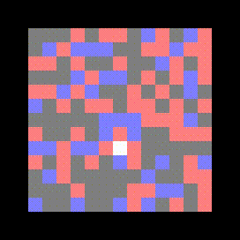

# Deep Reinforcement Learning for Rats

This mini-project is dedicated to the discovery of deep reinforcement learning techniques. The game is pretty simple: a rat is trapped on an island with only food and poison. We study different algorithms (from naive one to raffinements of DQN) to make the rat explore its environment in the most efficient way: avoid poison and eat all the food in the minimal distance.

